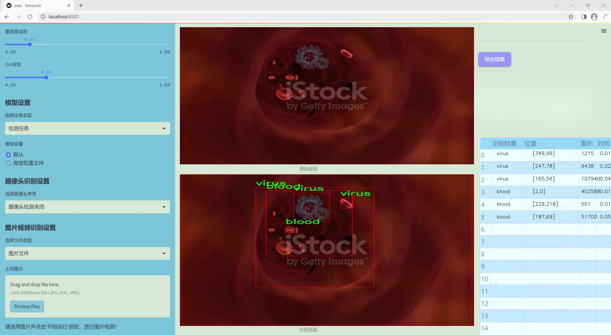
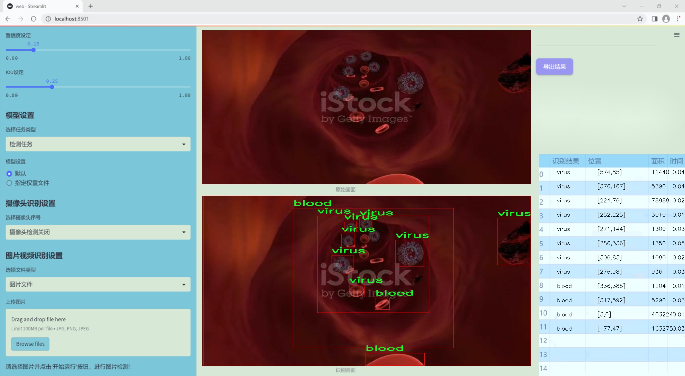
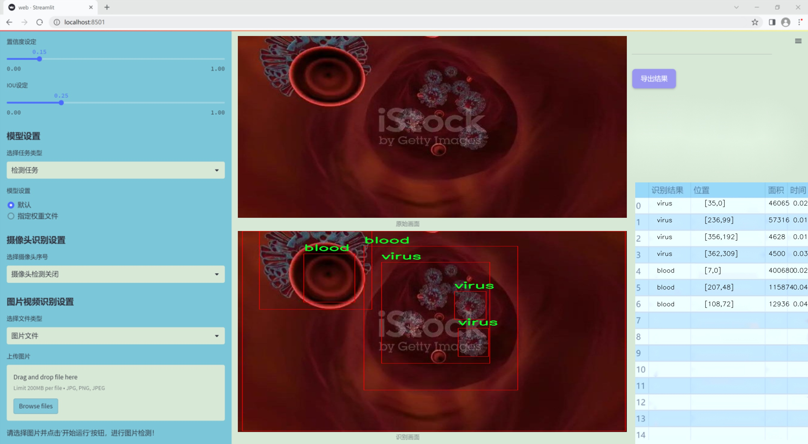
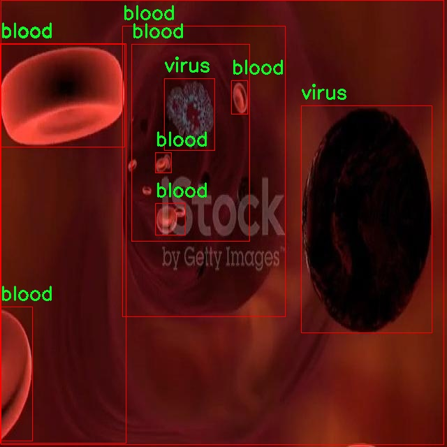
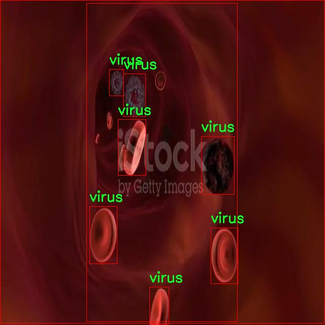
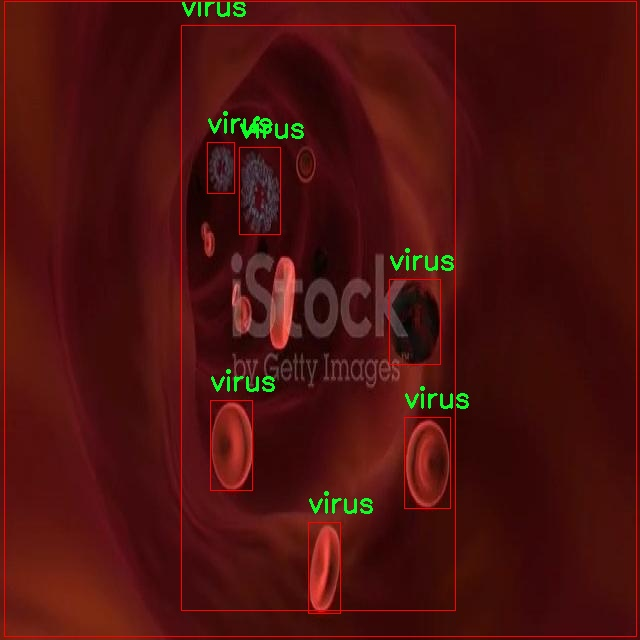
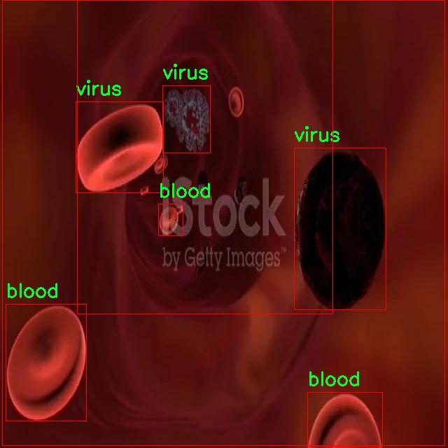
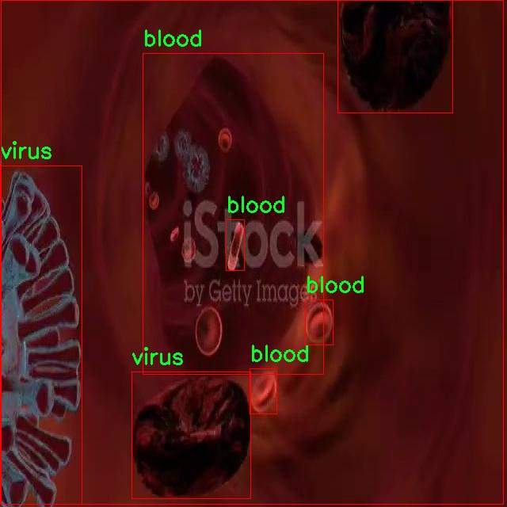

### 1.背景意义

研究背景与意义

随着生物医学技术的迅速发展，自动化和智能化的医疗检测系统在疾病诊断和治疗中扮演着越来越重要的角色。红细胞和病毒的检测是临床医学中不可或缺的环节，尤其是在传染病暴发和血液疾病诊断中，准确、高效的检测手段能够显著提高医疗响应速度和治疗效果。传统的检测方法往往依赖于人工观察和实验室分析，存在着时间长、效率低和主观性强等缺点。因此，基于计算机视觉的自动检测系统应运而生，成为解决这一问题的有效途径。

本研究旨在基于改进的YOLOv11模型，开发一种高效的血管中红细胞与病毒检测系统。YOLO（You Only Look Once）系列模型以其快速的检测速度和高精度而闻名，适合实时监测和分析。在本项目中，我们将利用一个包含216幅医学图像的数据集，该数据集专注于血液和病毒的识别，类别数量为2，分别为“blood”和“virus”。通过对该数据集的深入分析和处理，我们希望能够提升YOLOv11模型在医学图像分析中的表现，特别是在红细胞与病毒的分离和识别方面。

此外，随着数据集的不断丰富和模型的持续优化，基于深度学习的检测系统将能够适应更复杂的临床场景，为医生提供更为精准的辅助诊断工具。这不仅有助于提高疾病的早期检测率，还能在公共卫生危机中提供快速反应的能力，从而降低疾病传播的风险。综上所述，本研究的开展不仅具有重要的学术价值，也将为实际医疗应用提供有力支持，推动智能医疗的发展。

### 2.视频效果

[2.1 视频效果](https://www.bilibili.com/video/BV1rhSKYSEcH/)

### 3.图片效果







##### [项目涉及的源码数据来源链接](https://kdocs.cn/l/cszuIiCKVNis)**

注意：本项目提供训练的数据集和训练教程,由于版本持续更新,暂不提供权重文件（best.pt）,请按照6.训练教程进行训练后实现上图演示的效果。

### 4.数据集信息

##### 4.1 本项目数据集类别数＆类别名

nc: 2
names: ['blood', 'virus']


该项目为【目标检测】数据集，请在【训练教程和Web端加载模型教程（第三步）】这一步的时候按照【目标检测】部分的教程来训练

##### 4.2 本项目数据集信息介绍

本项目数据集信息介绍

本项目旨在改进YOLOv11模型，以实现对血管中红细胞与病毒的高效检测。为此，我们构建了一个专门针对医学领域的多样化数据集，旨在为模型的训练提供丰富而准确的样本。该数据集包含两个主要类别：血液细胞（blood）和病毒（virus），这两个类别在医学图像分析中具有重要的临床意义。通过对这两个类别的深入学习，模型能够更好地识别和区分血管中的红细胞与潜在的病毒感染，从而为临床诊断提供有力支持。

在数据集的构建过程中，我们采用了多种医学影像技术，包括显微镜图像和超声波图像，以确保数据的多样性和代表性。每个类别下的样本均经过精心挑选和标注，确保数据的准确性和可靠性。数据集中的血液细胞样本涵盖了不同的形态和状态，能够反映出各种生理和病理条件下的红细胞特征。而病毒样本则包括了多种类型的病毒图像，旨在帮助模型学习到不同病毒在血管中的表现形式。

此外，为了增强模型的泛化能力，我们还对数据集进行了数据增强处理，包括旋转、缩放、翻转等操作。这些技术不仅提高了数据集的多样性，还帮助模型在面对不同条件下的图像时，能够保持较高的识别准确率。通过这一系列的努力，我们期望构建一个高质量的数据集，为改进YOLOv11模型的训练提供坚实的基础，从而推动血管中红细胞与病毒检测技术的发展，最终实现更为精准的医学诊断和治疗方案。











### 5.全套项目环境部署视频教程（零基础手把手教学）

[5.1 所需软件PyCharm和Anaconda安装教程（第一步）](https://www.bilibili.com/video/BV1BoC1YCEKi/?spm_id_from=333.999.0.0&vd_source=bc9aec86d164b67a7004b996143742dc)


[5.2 安装Python虚拟环境创建和依赖库安装视频教程（第二步）](https://www.bilibili.com/video/BV1ZoC1YCEBw?spm_id_from=333.788.videopod.sections&vd_source=bc9aec86d164b67a7004b996143742dc)

### 6.改进YOLOv11训练教程和Web_UI前端加载模型教程（零基础手把手教学）

[6.1 改进YOLOv11训练教程和Web_UI前端加载模型教程（第三步）](https://www.bilibili.com/video/BV1BoC1YCEhR?spm_id_from=333.788.videopod.sections&vd_source=bc9aec86d164b67a7004b996143742dc)


按照上面的训练视频教程链接加载项目提供的数据集，运行train.py即可开始训练



     Epoch   gpu_mem       box       obj       cls    labels  img_size
     1/200     20.8G   0.01576   0.01955  0.007536        22      1280: 100%|██████████| 849/849 [14:42<00:00,  1.04s/it]
               Class     Images     Labels          P          R     mAP@.5 mAP@.5:.95: 100%|██████████| 213/213 [01:14<00:00,  2.87it/s]
                 all       3395      17314      0.994      0.957      0.0957      0.0843

     Epoch   gpu_mem       box       obj       cls    labels  img_size
     2/200     20.8G   0.01578   0.01923  0.007006        22      1280: 100%|██████████| 849/849 [14:44<00:00,  1.04s/it]
               Class     Images     Labels          P          R     mAP@.5 mAP@.5:.95: 100%|██████████| 213/213 [01:12<00:00,  2.95it/s]
                 all       3395      17314      0.996      0.956      0.0957      0.0845

     Epoch   gpu_mem       box       obj       cls    labels  img_size
     3/200     20.8G   0.01561    0.0191  0.006895        27      1280: 100%|██████████| 849/849 [10:56<00:00,  1.29it/s]
               Class     Images     Labels          P          R     mAP@.5 mAP@.5:.95: 100%|███████   | 187/213 [00:52<00:00,  4.04it/s]
                 all       3395      17314      0.996      0.957      0.0957      0.0845


###### [项目数据集下载链接](https://kdocs.cn/l/cszuIiCKVNis)

### 7.原始YOLOv11算法讲解


###### YOLOv11改进方向

与YOLOv 10相比，YOLOv 11有了巨大的改进，包括但不限于：

  * 增强的模型结构：模型具有改进的模型结构，以获取图像处理并形成预测
  * GPU优化：这是现代ML模型的反映，GPU训练ML模型在速度和准确性上都更好。
  * 速度：YOLOv 11模型现在经过增强和GPU优化以用于训练。通过优化，这些模型比它们的前版本快得多。在速度上达到了25%的延迟减少！
  * 更少的参数：更少的参数允许更快的模型，但v11的准确性不受影响
  * 更具适应性：更多支持的任务YOLOv 11支持多种类型的任务、多种类型的对象和多种类型的图像。

###### YOLOv11功能介绍

Glenn Jocher和他的团队制作了一个令人敬畏的YOLOv 11迭代，并且在图像人工智能的各个方面都提供了YOLO。YOLOv 11有多种型号，包括：

  * 对象检测-在训练时检测图像中的对象
  * 图像分割-超越对象检测，分割出图像中的对象
  * 姿态检测-当用点和线训练时绘制一个人的姿势
  * 定向检测（OBB）：类似于对象检测，但包围盒可以旋转
  * 图像分类-在训练时对图像进行分类

使用Ultralytics Library，这些模型还可以进行优化，以：

  * 跟踪-可以跟踪对象的路径
  * 易于导出-库可以以不同的格式和目的导出
  * 多场景-您可以针对不同的对象和图像训练模型

此外，Ultralytics还推出了YOLOv 11的企业模型，该模型将于10月31日发布。这将与开源的YOLOv
11模型并行，但将拥有更大的专有Ultralytics数据集。YOLOv 11是“建立在过去的成功”的其他版本的之上。

###### YOLOv11模型介绍

YOLOv 11附带了边界框模型（无后缀），实例分割（-seg），姿态估计（-pose），定向边界框（-obb）和分类（-cls）。

这些也有不同的尺寸：纳米（n），小（s），中（m），大（l），超大（x）。


YOLOv11模型

###### YOLOv11与前版本对比

与YOLOv10和YOLOv8相比，YOLOv11在Ultralytics的任何帖子中都没有直接提到。所以我会收集所有的数据来比较它们。感谢Ultralytics：

**检测：**


YOLOv11检测统计


YOLOv10检测统计

其中，Nano的mAPval在v11上为39.5，v10上为38.5；Small为47.0 vs 46.3，Medium为51.5 vs
51.1，Large为53.4 vs 53.2，Extra Large为54.7vs
54.4。现在，这可能看起来像是一种增量增加，但小小数的增加可能会对ML模型产生很大影响。总体而言，YOLOv11以0.3
mAPval的优势追平或击败YOLOv10。

现在，我们必须看看速度。在延迟方面，Nano在v11上为1.55 , v10上为1.84，Small为2.46 v2.49，Medium为4.70
v4.74，Large为6.16 v7.28，Extra Large为11.31
v10.70。延迟越低越好。YOLOv11提供了一个非常低的延迟相比，除了特大做得相当差的前身。

总的来说，Nano模型是令人振奋的，速度更快，性能相当。Extra Large在性能上有很好的提升，但它的延迟非常糟糕。

**分割：**


YOLOV11 分割统计


YOLOV9 分割统计


YOLOV8 分割数据

总体而言，YOLOv 11上的分割模型在大型和超大型模型方面比上一代YOLOv 8和YOLOv 9做得更好。

YOLOv 9 Segmentation没有提供任何关于延迟的统计数据。比较YOLOv 11延迟和YOLOv 8延迟，发现YOLOv 11比YOLOv
8快得多。YOLOv 11将大量GPU集成到他们的模型中，因此期望他们的模型甚至比CPU测试的基准更快！

姿态估计：


YOLOV11姿态估计统计


YOLOV8姿态估计统计

YOLOv 11的mAP 50 -95统计量也逐渐优于先前的YOLOv 8（除大型外）。然而，在速度方面，YOLOv
11姿势可以最大限度地减少延迟。其中一些延迟指标是版本的1/4！通过对这些模型进行GPU训练优化，我可以看到指标比显示的要好得多。

**定向边界框：**


YOLOv11 OBB统计


YOLOv8 OBB统计

OBB统计数据在mAP
50上并不是很好，只有非常小的改进，在某种程度上小于检测中的微小改进。然而，从v8到v11的速度减半，这表明YOLOv11在速度上做了很多努力。

**最后，分类：**


YOLOv 11 CLS统计


YOLOv8 CLS统计

从v8到v11，准确性也有了微小的提高。然而，速度大幅上升，CPU速度更快的型号。


### 8.200+种全套改进YOLOV11创新点原理讲解

#### 8.1 200+种全套改进YOLOV11创新点原理讲解大全

由于篇幅限制，每个创新点的具体原理讲解就不全部展开，具体见下列网址中的改进模块对应项目的技术原理博客网址【Blog】（创新点均为模块化搭建，原理适配YOLOv5~YOLOv11等各种版本）

[改进模块技术原理博客【Blog】网址链接](https://gitee.com/qunmasj/good)


#### 8.2 精选部分改进YOLOV11创新点原理讲解

###### 这里节选部分改进创新点展开原理讲解(完整的改进原理见上图和[改进模块技术原理博客链接](https://gitee.com/qunmasj/good)【如果此小节的图加载失败可以通过CSDN或者Github搜索该博客的标题访问原始博客，原始博客图片显示正常】

### Gold-YOLO简介
YOLO再升级：华为诺亚提出Gold-YOLO，聚集-分发机制打造新SOTA
在过去的几年中，YOLO系列模型已经成为实时目标检测领域的领先方法。许多研究通过修改架构、增加数据和设计新的损失函数，将基线推向了更高的水平。然而以前的模型仍然存在信息融合问题，尽管特征金字塔网络（FPN）和路径聚合网络（PANet）已经在一定程度上缓解了这个问题。因此，本研究提出了一种先进的聚集和分发机制（GD机制），该机制通过卷积和自注意力操作实现。这种新设计的模型被称为Gold-YOLO，它提升了多尺度特征融合能力，在所有模型尺度上实现了延迟和准确性的理想平衡。此外，本文首次在YOLO系列中实现了MAE风格的预训练，使得YOLO系列模型能够从无监督预训练中受益。Gold-YOLO-N在COCO val2017数据集上实现了出色的39.9% AP，并在T4 GPU上实现了1030 FPS，超过了之前的SOTA模型YOLOv6-3.0-N，其FPS相似，但性能提升了2.4%。


#### Gold-YOLO


YOLO系列的中间层结构采用了传统的FPN结构，其中包含多个分支用于多尺度特征融合。然而，它只充分融合来自相邻级别的特征，对于其他层次的信息只能间接地进行“递归”获取。

传统的FPN结构在信息传输过程中存在丢失大量信息的问题。这是因为层之间的信息交互仅限于中间层选择的信息，未被选择的信息在传输过程中被丢弃。这种情况导致某个Level的信息只能充分辅助相邻层，而对其他全局层的帮助较弱。因此，整体上信息融合的有效性可能受到限制。
为了避免在传输过程中丢失信息，本文采用了一种新颖的“聚集和分发”机制（GD），放弃了原始的递归方法。该机制使用一个统一的模块来收集和融合所有Level的信息，并将其分发到不同的Level。通过这种方式，作者不仅避免了传统FPN结构固有的信息丢失问题，还增强了中间层的部分信息融合能力，而且并没有显著增加延迟。


# 8.低阶聚合和分发分支 Low-stage gather-and-distribute branch
从主干网络中选择输出的B2、B3、B4、B5特征进行融合，以获取保留小目标信息的高分辨率特征。


低阶特征对齐模块 (Low-stage feature alignment module)： 在低阶特征对齐模块（Low-FAM）中，采用平均池化（AvgPool）操作对输入特征进行下采样，以实现统一的大小。通过将特征调整为组中最小的特征大小（ R B 4 = 1 / 4 R ） （R_{B4} = 1/4R）（R 
B4 =1/4R），我们得到对齐后的特征F a l i g n F_{align}F align 。低阶特征对齐技术确保了信息的高效聚合，同时通过变换器模块来最小化后续处理的计算复杂性。其中选择 R B 4 R_{B4}R B4 作为特征对齐的目标大小主要基于保留更多的低层信息的同时不会带来较大的计算延迟。
低阶信息融合模块(Low-stage information fusion module)： 低阶信息融合模块（Low-IFM）设计包括多层重新参数化卷积块（RepBlock）和分裂操作。具体而言，RepBlock以F a l i g n ( c h a n n e l = s u m ( C B 2 ， C B 3 ， C B 4 ， C B 5 ) ) F_{align} (channel= sum(C_{B2}，C_{B3}，C_{B4}，C_{B5}))F align (channel=sum(C B2 ，C B3 ，C B4 ，C B5 )作为输入，并生成F f u s e ( c h a n n e l = C B 4 + C B 5 ) F_{fuse} (channel= C_{B4} + C_{B5})F fuse (channel=C B4 +C B5 )。其中中间通道是一个可调整的值（例如256），以适应不同的模型大小。由RepBlock生成的特征随后在通道维度上分裂为F i n j P 3 Finj_P3Finj P 3和F i n j P 4 Finj_P4Finj P 4，然后与不同级别的特征进行融合。


# 8.高阶聚合和分发分支 High-stage gather-and-distribute branch
高级全局特征对齐模块（High-GD）将由低级全局特征对齐模块（Low-GD）生成的特征{P3, P4, P5}进行融合。


高级特征对齐模块(High-stage feature alignment module)： High-FAM由avgpool组成，用于将输入特征的维度减小到统一的尺寸。具体而言，当输入特征的尺寸为{R P 3 R_{P3}R P3 , R P 4 R_{P4}R P4 , R P 5 R_{P 5}R P5 }时，avgpool将特征尺寸减小到该特征组中最小的尺寸（R P 5 R_{P5}R P5  = 1/8R）。由于transformer模块提取了高层次的信息，池化操作有助于信息聚合，同时降低了transformer模块后续步骤的计算需求。

Transformer融合模块由多个堆叠的transformer组成，transformer块的数量为L。每个transformer块包括一个多头注意力块、一个前馈网络（FFN）和残差连接。采用与LeViT相同的设置来配置多头注意力块，使用16个通道作为键K和查询Q的头维度，32个通道作为值V的头维度。为了加速推理过程，将层归一化操作替换为批归一化，并将所有的GELU激活函数替换为ReLU。为了增强变换器块的局部连接，在两个1x1卷积层之间添加了一个深度卷积层。同时，将FFN的扩展因子设置为2，以在速度和计算成本之间取得平衡。

信息注入模块(Information injection module)： 高级全局特征对齐模块（High-GD）中的信息注入模块与低级全局特征对齐模块（Low-GD）中的相同。在高级阶段，局部特征（Flocal）等于Pi，因此公式如下所示：


### 增强的跨层信息流动 Enhanced cross-layer information flow
为了进一步提升性能，从YOLOv11 中的PAFPN模块中得到启发，引入了Inject-LAF模块。该模块是注入模块的增强版，包括了一个轻量级相邻层融合（LAF）模块，该模块被添加到注入模块的输入位置。为了在速度和准确性之间取得平衡，设计了两个LAF模型：LAF低级模型和LAF高级模型，分别用于低级注入（合并相邻两层的特征）和高级注入（合并相邻一层的特征）。它们的结构如图5(b)所示。为了确保来自不同层级的特征图与目标大小对齐，在实现中的两个LAF模型仅使用了三个操作符：双线性插值（上采样过小的特征）、平均池化（下采样过大的特征）和1x1卷积（调整与目标通道不同的特征）。模型中的LAF模块与信息注入模块的结合有效地平衡了准确性和速度之间的关系。通过使用简化的操作，能够增加不同层级之间的信息流路径数量，从而提高性能而不显著增加延迟。


### 9.系统功能展示

图9.1.系统支持检测结果表格显示

  图9.2.系统支持置信度和IOU阈值手动调节

  图9.3.系统支持自定义加载权重文件best.pt(需要你通过步骤5中训练获得)

  图9.4.系统支持摄像头实时识别

  图9.5.系统支持图片识别

  图9.6.系统支持视频识别

  图9.7.系统支持识别结果文件自动保存

  图9.8.系统支持Excel导出检测结果数据


### 10. YOLOv11核心改进源码讲解

#### 10.1 SwinTransformer.py

以下是经过简化和注释的核心代码，保留了Swin Transformer的主要结构和功能。

```python
import torch
import torch.nn as nn
import torch.nn.functional as F
import numpy as np
from timm.models.layers import DropPath, to_2tuple, trunc_normal_

class Mlp(nn.Module):
    """多层感知机（MLP）模块"""
    def __init__(self, in_features, hidden_features=None, out_features=None, act_layer=nn.GELU, drop=0.):
        super().__init__()
        out_features = out_features or in_features  # 输出特征数
        hidden_features = hidden_features or in_features  # 隐藏层特征数
        self.fc1 = nn.Linear(in_features, hidden_features)  # 第一层线性变换
        self.act = act_layer()  # 激活函数
        self.fc2 = nn.Linear(hidden_features, out_features)  # 第二层线性变换
        self.drop = nn.Dropout(drop)  # Dropout层

    def forward(self, x):
        """前向传播"""
        x = self.fc1(x)
        x = self.act(x)
        x = self.drop(x)
        x = self.fc2(x)
        x = self.drop(x)
        return x

def window_partition(x, window_size):
    """将输入张量分割成窗口"""
    B, H, W, C = x.shape  # 获取输入的维度
    x = x.view(B, H // window_size, window_size, W // window_size, window_size, C)  # 重新排列维度
    windows = x.permute(0, 1, 3, 2, 4, 5).contiguous().view(-1, window_size, window_size, C)  # 生成窗口
    return windows

def window_reverse(windows, window_size, H, W):
    """将窗口合并回原始张量"""
    B = int(windows.shape[0] / (H * W / window_size / window_size))  # 计算批次大小
    x = windows.view(B, H // window_size, W // window_size, window_size, window_size, -1)  # 重新排列维度
    x = x.permute(0, 1, 3, 2, 4, 5).contiguous().view(B, H, W, -1)  # 合并窗口
    return x

class WindowAttention(nn.Module):
    """窗口基础的多头自注意力模块"""
    def __init__(self, dim, window_size, num_heads, qkv_bias=True, attn_drop=0., proj_drop=0.):
        super().__init__()
        self.dim = dim
        self.window_size = window_size  # 窗口大小
        self.num_heads = num_heads  # 注意力头数
        head_dim = dim // num_heads  # 每个头的维度
        self.scale = head_dim ** -0.5  # 缩放因子

        # 定义相对位置偏置参数
        self.relative_position_bias_table = nn.Parameter(
            torch.zeros((2 * window_size[0] - 1) * (2 * window_size[1] - 1), num_heads))

        # 计算相对位置索引
        coords_h = torch.arange(self.window_size[0])
        coords_w = torch.arange(self.window_size[1])
        coords = torch.stack(torch.meshgrid([coords_h, coords_w]))  # 生成坐标网格
        coords_flatten = torch.flatten(coords, 1)  # 展平坐标
        relative_coords = coords_flatten[:, :, None] - coords_flatten[:, None, :]  # 计算相对坐标
        relative_coords = relative_coords.permute(1, 2, 0).contiguous()  # 重新排列
        relative_coords[:, :, 0] += self.window_size[0] - 1  # 偏移
        relative_coords[:, :, 1] += self.window_size[1] - 1
        relative_coords[:, :, 0] *= 2 * self.window_size[1] - 1
        self.relative_position_index = relative_coords.sum(-1)  # 计算相对位置索引
        self.qkv = nn.Linear(dim, dim * 3, bias=qkv_bias)  # 线性变换
        self.attn_drop = nn.Dropout(attn_drop)  # 注意力的Dropout
        self.proj = nn.Linear(dim, dim)  # 输出线性变换
        self.proj_drop = nn.Dropout(proj_drop)  # 输出的Dropout
        trunc_normal_(self.relative_position_bias_table, std=.02)  # 初始化相对位置偏置
        self.softmax = nn.Softmax(dim=-1)  # Softmax层

    def forward(self, x, mask=None):
        """前向传播"""
        B_, N, C = x.shape  # 获取输入维度
        qkv = self.qkv(x).reshape(B_, N, 3, self.num_heads, C // self.num_heads).permute(2, 0, 3, 1, 4)  # 计算Q, K, V
        q, k, v = qkv[0], qkv[1], qkv[2]  # 分离Q, K, V

        q = q * self.scale  # 缩放Q
        attn = (q @ k.transpose(-2, -1))  # 计算注意力分数

        # 添加相对位置偏置
        relative_position_bias = self.relative_position_bias_table[self.relative_position_index.view(-1)].view(
            self.window_size[0] * self.window_size[1], self.window_size[0] * self.window_size[1], -1)
        relative_position_bias = relative_position_bias.permute(2, 0, 1).contiguous()  # 重新排列
        attn = attn + relative_position_bias.unsqueeze(0)  # 加入相对位置偏置

        attn = self.softmax(attn)  # 计算注意力权重
        attn = self.attn_drop(attn)  # 应用Dropout

        x = (attn @ v).transpose(1, 2).reshape(B_, N, C)  # 计算输出
        x = self.proj(x)  # 线性变换
        x = self.proj_drop(x)  # 应用Dropout
        return x

class SwinTransformer(nn.Module):
    """Swin Transformer主类"""
    def __init__(self, pretrain_img_size=224, patch_size=4, in_chans=3, embed_dim=96, depths=[2, 2, 6, 2],
                 num_heads=[3, 6, 12, 24], window_size=7, mlp_ratio=4., drop_rate=0., attn_drop_rate=0.,
                 drop_path_rate=0.2, norm_layer=nn.LayerNorm, patch_norm=True, out_indices=(0, 1, 2, 3)):
        super().__init__()

        self.patch_embed = PatchEmbed(patch_size=patch_size, in_chans=in_chans, embed_dim=embed_dim)  # 图像分块嵌入
        self.layers = nn.ModuleList()  # 存储各层

        # 构建各层
        for i_layer in range(len(depths)):
            layer = BasicLayer(
                dim=int(embed_dim * 2 ** i_layer),
                depth=depths[i_layer],
                num_heads=num_heads[i_layer],
                window_size=window_size,
                mlp_ratio=mlp_ratio,
                drop=drop_rate,
                attn_drop=attn_drop_rate,
                norm_layer=norm_layer,
                downsample=PatchMerging if (i_layer < len(depths) - 1) else None)
            )
            self.layers.append(layer)

    def forward(self, x):
        """前向传播"""
        x = self.patch_embed(x)  # 嵌入图像
        outs = []
        for layer in self.layers:
            x_out, _, _, _, _, _ = layer(x)  # 通过每一层
            outs.append(x_out)  # 保存输出
        return outs  # 返回所有层的输出

def SwinTransformer_Tiny(weights=''):
    """构建Swin Transformer Tiny模型"""
    model = SwinTransformer(depths=[2, 2, 6, 2], num_heads=[3, 6, 12, 24])  # 创建模型
    if weights:
        model.load_state_dict(torch.load(weights)['model'])  # 加载权重
    return model
```

### 主要功能概述：
1. **Mlp**：实现了一个简单的多层感知机，包含两个线性层和激活函数。
2. **window_partition** 和 **window_reverse**：实现了将输入张量分割成窗口和将窗口合并回原始张量的功能。
3. **WindowAttention**：实现了窗口基础的多头自注意力机制，包含相对位置偏置的计算。
4. **SwinTransformer**：实现了Swin Transformer的整体结构，包含图像嵌入、多个层的堆叠等功能。
5. **SwinTransformer_Tiny**：构建了一个小型的Swin Transformer模型，并可选择加载预训练权重。

以上代码是Swin Transformer的核心部分，提供了基本的功能和结构。

这个文件实现了Swin Transformer模型，主要用于计算机视觉任务。Swin Transformer是一种分层的视觉Transformer架构，采用了窗口注意力机制，通过局部窗口内的自注意力来提高计算效率，同时通过分层结构来处理不同尺度的特征。

首先，文件中定义了一个多层感知机（Mlp）类，它包含两个线性层和一个激活函数（默认为GELU），并在每个线性层后应用了Dropout以防止过拟合。这个模块通常用于Transformer中的前馈网络部分。

接下来，定义了两个函数`window_partition`和`window_reverse`，用于将输入特征分割成窗口和将窗口合并回原始特征。窗口分割有助于在局部区域内计算自注意力，从而减少计算复杂度。

`WindowAttention`类实现了窗口基础的多头自注意力机制（W-MSA），它支持相对位置偏置，并能够处理平移窗口（SW-MSA）。该类的构造函数中定义了相对位置偏置表，并计算了每个窗口内的相对位置索引。在前向传播中，输入特征被分为查询、键和值，并计算注意力权重，最后将注意力应用于值。

`SwinTransformerBlock`类实现了Swin Transformer的基本模块，包含了窗口注意力和前馈网络。它支持窗口的平移，通过对输入特征进行规范化、分割、计算注意力、合并窗口等步骤，完成了Transformer块的前向传播。

`PatchMerging`类用于将特征图的patch进行合并，减少特征图的分辨率，并增加通道数。这一过程通常在每个阶段的末尾进行，以实现下采样。

`BasicLayer`类代表Swin Transformer的一个基本层，它由多个Swin Transformer块组成，并在必要时包含下采样层。它还计算了用于SW-MSA的注意力掩码。

`PatchEmbed`类将输入图像分割成patch，并通过卷积层进行线性投影，生成嵌入特征。它还可以选择性地应用归一化。

`SwinTransformer`类是整个模型的核心，构造函数中定义了模型的各个参数，包括输入图像的大小、patch大小、嵌入维度、各层的深度和头数等。它还实现了前向传播过程，将输入图像经过patch嵌入、位置嵌入、多个层的处理，最终输出各层的特征。

最后，`update_weight`函数用于更新模型的权重，确保模型字典中的权重与加载的权重字典匹配。`SwinTransformer_Tiny`函数则是一个便捷的构造函数，用于创建一个小型的Swin Transformer模型，并可选择性地加载预训练权重。

总体来说，这个文件实现了Swin Transformer的各个组成部分，提供了一个灵活的框架用于视觉任务的特征提取和表示学习。

#### 10.2 fadc.py

以下是代码中最核心的部分，并附上详细的中文注释：

```python
import torch
import torch.nn as nn
import torch.nn.functional as F

class OmniAttention(nn.Module):
    def __init__(self, in_planes, out_planes, kernel_size, groups=1, reduction=0.0625, kernel_num=4, min_channel=16):
        super(OmniAttention, self).__init__()
        # 计算注意力通道数
        attention_channel = max(int(in_planes * reduction), min_channel)
        self.kernel_size = kernel_size
        self.kernel_num = kernel_num
        self.temperature = 1.0  # 温度参数，用于调整注意力的平滑程度

        # 定义层
        self.avgpool = nn.AdaptiveAvgPool2d(1)  # 自适应平均池化
        self.fc = nn.Conv2d(in_planes, attention_channel, 1, bias=False)  # 全连接层
        self.bn = nn.BatchNorm2d(attention_channel)  # 批归一化
        self.relu = nn.ReLU(inplace=True)  # ReLU激活函数

        # 定义通道注意力
        self.channel_fc = nn.Conv2d(attention_channel, in_planes, 1, bias=True)
        self.func_channel = self.get_channel_attention

        # 定义滤波器注意力
        if in_planes == groups and in_planes == out_planes:  # 深度卷积
            self.func_filter = self.skip
        else:
            self.filter_fc = nn.Conv2d(attention_channel, out_planes, 1, bias=True)
            self.func_filter = self.get_filter_attention

        # 定义空间注意力
        if kernel_size == 1:  # 点卷积
            self.func_spatial = self.skip
        else:
            self.spatial_fc = nn.Conv2d(attention_channel, kernel_size * kernel_size, 1, bias=True)
            self.func_spatial = self.get_spatial_attention

        # 定义核注意力
        if kernel_num == 1:
            self.func_kernel = self.skip
        else:
            self.kernel_fc = nn.Conv2d(attention_channel, kernel_num, 1, bias=True)
            self.func_kernel = self.get_kernel_attention

        self._initialize_weights()  # 初始化权重

    def _initialize_weights(self):
        # 权重初始化
        for m in self.modules():
            if isinstance(m, nn.Conv2d):
                nn.init.kaiming_normal_(m.weight, mode='fan_out', nonlinearity='relu')
                if m.bias is not None:
                    nn.init.constant_(m.bias, 0)
            if isinstance(m, nn.BatchNorm2d):
                nn.init.constant_(m.weight, 1)
                nn.init.constant_(m.bias, 0)

    def get_channel_attention(self, x):
        # 计算通道注意力
        channel_attention = torch.sigmoid(self.channel_fc(x).view(x.size(0), -1, 1, 1) / self.temperature)
        return channel_attention

    def get_filter_attention(self, x):
        # 计算滤波器注意力
        filter_attention = torch.sigmoid(self.filter_fc(x).view(x.size(0), -1, 1, 1) / self.temperature)
        return filter_attention

    def get_spatial_attention(self, x):
        # 计算空间注意力
        spatial_attention = self.spatial_fc(x).view(x.size(0), 1, 1, 1, self.kernel_size, self.kernel_size)
        spatial_attention = torch.sigmoid(spatial_attention / self.temperature)
        return spatial_attention

    def get_kernel_attention(self, x):
        # 计算核注意力
        kernel_attention = self.kernel_fc(x).view(x.size(0), -1, 1, 1, 1, 1)
        kernel_attention = F.softmax(kernel_attention / self.temperature, dim=1)
        return kernel_attention

    def forward(self, x):
        # 前向传播
        x = self.avgpool(x)  # 自适应平均池化
        x = self.fc(x)  # 全连接层
        x = self.bn(x)  # 批归一化
        x = self.relu(x)  # ReLU激活
        return self.func_channel(x), self.func_filter(x), self.func_spatial(x), self.func_kernel(x)  # 返回四种注意力

class AdaptiveDilatedConv(nn.Module):
    """自适应膨胀卷积类"""
    def __init__(self, in_channels, out_channels, kernel_size, stride=1, padding=0, dilation=1, groups=1, bias=True):
        super(AdaptiveDilatedConv, self).__init__()
        self.conv = nn.Conv2d(in_channels, out_channels, kernel_size, stride=stride, padding=padding, dilation=dilation, groups=groups, bias=bias)

    def forward(self, x):
        # 前向传播
        return self.conv(x)  # 返回卷积结果
```

### 代码说明
1. **OmniAttention 类**：实现了多种注意力机制，包括通道注意力、滤波器注意力、空间注意力和核注意力。通过对输入特征进行处理，生成不同类型的注意力权重，用于增强模型的表达能力。

2. **AdaptiveDilatedConv 类**：自适应膨胀卷积的实现，允许在卷积操作中使用不同的膨胀率，从而捕捉不同尺度的特征。此类封装了常规卷积操作，便于在模型中使用。

以上是核心部分的代码和详细注释，涵盖了主要的功能和结构。

这个程序文件 `fadc.py` 是一个用于实现自适应膨胀卷积（Adaptive Dilated Convolution）和频率选择的深度学习模块，主要基于 PyTorch 框架。文件中定义了多个类和函数，以下是对其主要内容的讲解。

首先，文件导入了必要的库，包括 PyTorch 的核心库和一些功能模块。接着，定义了一个名为 `OmniAttention` 的类，该类实现了一种全局注意力机制。该类的构造函数接受多个参数，如输入通道数、输出通道数、卷积核大小等，并根据这些参数初始化不同的卷积层和激活函数。`OmniAttention` 类中定义了多个方法来计算通道注意力、过滤器注意力、空间注意力和卷积核注意力，最后在 `forward` 方法中将这些注意力机制应用于输入数据。

接下来，定义了一个名为 `generate_laplacian_pyramid` 的函数，用于生成拉普拉斯金字塔。该函数通过逐层下采样输入张量，计算高频和低频部分，并将其存储在金字塔中。该函数的参数包括输入张量、金字塔层数以及插值模式等。

然后，定义了 `FrequencySelection` 类，该类用于在频域中选择特定的频率成分。该类的构造函数接受多个参数，包括输入通道数、频率列表、空间卷积的参数等。该类中实现了频率选择的逻辑，并在 `forward` 方法中将输入数据与选择的频率成分进行处理。

最后，定义了两个自适应卷积类 `AdaptiveDilatedConv` 和 `AdaptiveDilatedDWConv`，它们继承自 `ModulatedDeformConv2d`。这两个类的构造函数中初始化了卷积层、偏移量卷积层和掩码卷积层，并根据不同的参数配置相应的注意力机制和频率选择。它们的 `forward` 方法实现了自适应卷积的具体计算过程，包括对输入数据的偏移、掩码和权重的计算。

总体来说，这个程序文件实现了一个复杂的卷积神经网络模块，结合了自适应卷积、注意力机制和频率选择等先进的技术，适用于图像处理和计算机视觉等领域。

#### 10.3 CSwomTramsformer.py

以下是提取出的核心代码部分，并添加了详细的中文注释：

```python
import torch
import torch.nn as nn
import torch.nn.functional as F
import numpy as np

class Mlp(nn.Module):
    """多层感知机（MLP）模块"""
    def __init__(self, in_features, hidden_features=None, out_features=None, act_layer=nn.GELU, drop=0.):
        super().__init__()
        out_features = out_features or in_features  # 输出特征数
        hidden_features = hidden_features or in_features  # 隐藏层特征数
        self.fc1 = nn.Linear(in_features, hidden_features)  # 第一层线性变换
        self.act = act_layer()  # 激活函数
        self.fc2 = nn.Linear(hidden_features, out_features)  # 第二层线性变换
        self.drop = nn.Dropout(drop)  # Dropout层

    def forward(self, x):
        """前向传播"""
        x = self.fc1(x)  # 线性变换
        x = self.act(x)  # 激活
        x = self.drop(x)  # Dropout
        x = self.fc2(x)  # 线性变换
        x = self.drop(x)  # Dropout
        return x

class CSWinBlock(nn.Module):
    """CSWin Transformer中的一个块"""
    def __init__(self, dim, num_heads, mlp_ratio=4., drop=0., attn_drop=0.):
        super().__init__()
        self.dim = dim  # 输入特征维度
        self.num_heads = num_heads  # 注意力头数
        self.mlp_ratio = mlp_ratio  # MLP的隐藏层比率
        self.qkv = nn.Linear(dim, dim * 3)  # 线性变换生成Q、K、V
        self.norm1 = nn.LayerNorm(dim)  # 第一层归一化
        self.attn = LePEAttention(dim, num_heads=num_heads, attn_drop=attn_drop)  # 注意力层
        self.mlp = Mlp(in_features=dim, hidden_features=int(dim * mlp_ratio), out_features=dim)  # MLP层
        self.norm2 = nn.LayerNorm(dim)  # 第二层归一化

    def forward(self, x):
        """前向传播"""
        img = self.norm1(x)  # 归一化
        qkv = self.qkv(img).reshape(-1, 3, self.dim)  # 生成Q、K、V
        attn_output = self.attn(qkv)  # 注意力计算
        x = x + attn_output  # 残差连接
        x = x + self.mlp(self.norm2(x))  # MLP层和残差连接
        return x

class CSWinTransformer(nn.Module):
    """CSWin Transformer模型"""
    def __init__(self, img_size=640, in_chans=3, num_classes=1000, embed_dim=96, depth=[2, 2, 6, 2]):
        super().__init__()
        self.num_classes = num_classes  # 类别数
        self.embed_dim = embed_dim  # 嵌入维度

        # 第一阶段的卷积嵌入
        self.stage1_conv_embed = nn.Sequential(
            nn.Conv2d(in_chans, embed_dim, kernel_size=7, stride=4, padding=2),
            nn.LayerNorm(embed_dim)
        )

        # 定义多个CSWinBlock
        self.stage1 = nn.ModuleList([
            CSWinBlock(dim=embed_dim, num_heads=12) for _ in range(depth[0])
        ])
        # 其他阶段的定义略去...

    def forward(self, x):
        """前向传播"""
        x = self.stage1_conv_embed(x)  # 卷积嵌入
        for blk in self.stage1:
            x = blk(x)  # 通过每个块
        return x

# 示例代码：创建模型并进行前向传播
if __name__ == '__main__':
    inputs = torch.randn((1, 3, 640, 640))  # 输入张量
    model = CSWinTransformer()  # 创建模型
    res = model(inputs)  # 前向传播
    print(res.size())  # 输出结果的尺寸
```

### 代码注释说明：
1. **Mlp类**：实现了一个多层感知机，包含两个线性层和一个激活函数，支持Dropout。
2. **CSWinBlock类**：实现了CSWin Transformer中的一个基本块，包含注意力机制和MLP，使用残差连接。
3. **CSWinTransformer类**：定义了整个CSWin Transformer模型的结构，包括输入嵌入和多个CSWinBlock的堆叠。
4. **前向传播**：展示了如何通过模型进行前向传播并输出结果的尺寸。

以上代码为CSWin Transformer的核心部分，其他辅助函数和类被省略以保持简洁。

这个程序文件 `CSWinTransformer.py` 实现了 CSWin Transformer 模型，这是一个用于计算机视觉任务的深度学习模型。文件中包含了多个类和函数，主要功能是构建和训练 CSWin Transformer 网络。

首先，文件导入了必要的库，包括 PyTorch 和一些用于图像处理和模型构建的辅助函数。接着，定义了一些全局变量和常量，便于后续使用。

文件中定义了多个类。`Mlp` 类实现了一个多层感知机（MLP），包含两个线性层和一个激活函数（默认为 GELU），并在每个线性层后添加了 dropout 层以防止过拟合。`LePEAttention` 类实现了一个局部增强的自注意力机制，主要通过将输入图像划分为窗口来计算注意力。它支持多头注意力机制，并可以处理不同的分辨率和窗口大小。

`CSWinBlock` 类是 CSWin Transformer 的基本构建块，包含了多头自注意力层和 MLP 层。它通过归一化层和残差连接来增强模型的学习能力。该类根据输入的分辨率和分支数量，动态地构建不同的注意力层。

`Merge_Block` 类用于在不同阶段之间合并特征图，通常是通过卷积层来减少特征图的尺寸，同时增加通道数。

`CSWinTransformer` 类是整个模型的核心，负责将输入图像转换为特征表示。它包含多个阶段，每个阶段由多个 CSWinBlock 组成。每个阶段后面都有一个 Merge_Block，用于处理特征图的合并和下采样。模型的初始化函数中设置了输入参数，包括图像大小、补丁大小、嵌入维度、深度等，并使用这些参数构建各个阶段的模块。

此外，文件中还定义了一些辅助函数，例如 `img2windows` 和 `windows2img`，用于在图像和窗口之间进行转换，方便在自注意力计算中使用。

最后，文件提供了四个不同规模的模型构造函数（`CSWin_tiny`、`CSWin_small`、`CSWin_base` 和 `CSWin_large`），允许用户根据需求选择不同的模型结构。每个函数都可以选择加载预训练权重，以便在特定任务上进行微调。

在文件的最后部分，提供了一个简单的测试代码，创建了不同规模的模型并对随机输入进行前向传播，输出每个模型的特征图大小。这部分代码用于验证模型的构建是否正确。

#### 10.4 val.py

以下是代码中最核心的部分，并附上详细的中文注释：

```python
class DetectionValidator(BaseValidator):
    """
    扩展自 BaseValidator 类的检测模型验证器。
    """

    def __init__(self, dataloader=None, save_dir=None, pbar=None, args=None, _callbacks=None):
        """初始化检测模型所需的变量和设置。"""
        super().__init__(dataloader, save_dir, pbar, args, _callbacks)
        self.nt_per_class = None  # 每个类别的目标数量
        self.is_coco = False  # 是否为 COCO 数据集
        self.class_map = None  # 类别映射
        self.args.task = "detect"  # 设置任务为检测
        self.metrics = DetMetrics(save_dir=self.save_dir, on_plot=self.on_plot)  # 初始化检测指标
        self.iouv = torch.linspace(0.5, 0.95, 10)  # mAP@0.5:0.95 的 IoU 向量
        self.niou = self.iouv.numel()  # IoU 的数量
        self.lb = []  # 用于自动标注

    def preprocess(self, batch):
        """对 YOLO 训练的图像批次进行预处理。"""
        # 将图像移动到设备上并进行归一化处理
        batch["img"] = batch["img"].to(self.device, non_blocking=True)
        batch["img"] = (batch["img"].half() if self.args.half else batch["img"].float()) / 255
        for k in ["batch_idx", "cls", "bboxes"]:
            batch[k] = batch[k].to(self.device)

        # 如果需要保存混合数据，则进行处理
        if self.args.save_hybrid:
            height, width = batch["img"].shape[2:]
            nb = len(batch["img"])
            bboxes = batch["bboxes"] * torch.tensor((width, height, width, height), device=self.device)
            self.lb = (
                [
                    torch.cat([batch["cls"][batch["batch_idx"] == i], bboxes[batch["batch_idx"] == i]], dim=-1)
                    for i in range(nb)
                ]
                if self.args.save_hybrid
                else []
            )  # 用于自动标注

        return batch

    def postprocess(self, preds):
        """对预测输出应用非极大值抑制。"""
        return ops.non_max_suppression(
            preds,
            self.args.conf,
            self.args.iou,
            labels=self.lb,
            multi_label=True,
            agnostic=self.args.single_cls,
            max_det=self.args.max_det,
        )

    def update_metrics(self, preds, batch):
        """更新指标统计信息。"""
        for si, pred in enumerate(preds):
            self.seen += 1  # 记录已处理的样本数量
            npr = len(pred)  # 当前预测的数量
            stat = dict(
                conf=torch.zeros(0, device=self.device),
                pred_cls=torch.zeros(0, device=self.device),
                tp=torch.zeros(npr, self.niou, dtype=torch.bool, device=self.device),
            )
            pbatch = self._prepare_batch(si, batch)  # 准备当前批次的真实标签
            cls, bbox = pbatch.pop("cls"), pbatch.pop("bbox")  # 提取类别和边界框
            nl = len(cls)  # 真实标签的数量
            stat["target_cls"] = cls  # 记录真实类别

            if npr == 0:  # 如果没有预测
                if nl:
                    for k in self.stats.keys():
                        self.stats[k].append(stat[k])
                continue

            # 处理预测
            if self.args.single_cls:
                pred[:, 5] = 0  # 如果是单类检测，设置类别为0
            predn = self._prepare_pred(pred, pbatch)  # 准备预测数据
            stat["conf"] = predn[:, 4]  # 置信度
            stat["pred_cls"] = predn[:, 5]  # 预测类别

            # 评估
            if nl:
                stat["tp"] = self._process_batch(predn, bbox, cls)  # 计算真阳性
            for k in self.stats.keys():
                self.stats[k].append(stat[k])  # 更新统计信息

    def get_stats(self):
        """返回指标统计信息和结果字典。"""
        stats = {k: torch.cat(v, 0).cpu().numpy() for k, v in self.stats.items()}  # 转换为 numpy 数组
        if len(stats) and stats["tp"].any():
            self.metrics.process(**stats)  # 处理指标
        self.nt_per_class = np.bincount(
            stats["target_cls"].astype(int), minlength=self.nc
        )  # 计算每个类别的目标数量
        return self.metrics.results_dict  # 返回结果字典
```

### 代码核心部分解释：
1. **DetectionValidator 类**：该类负责对 YOLO 模型进行验证，继承自 `BaseValidator`。
2. **__init__ 方法**：初始化验证器的基本参数，包括数据加载器、保存目录、指标等。
3. **preprocess 方法**：对输入的图像批次进行预处理，包括归一化和将数据移动到指定设备。
4. **postprocess 方法**：对模型的预测结果应用非极大值抑制，以减少重复检测。
5. **update_metrics 方法**：更新模型的评估指标，包括计算真阳性、置信度等。
6. **get_stats 方法**：计算并返回模型的评估结果，包含每个类别的目标数量和相关指标。 

这些方法共同构成了检测模型验证的核心逻辑，确保模型在验证集上的性能能够被准确评估。

这个程序文件 `val.py` 是一个用于验证目标检测模型（如 YOLO）的类和方法的实现。它主要依赖于 Ultralytics YOLO 库，并扩展了一个基类 `BaseValidator`。该文件的核心功能是对模型在验证集上的性能进行评估，计算各种指标，并可视化结果。

首先，程序导入了一些必要的库，包括 `os`、`numpy` 和 `torch`，以及 Ultralytics YOLO 中的一些模块。接着定义了 `DetectionValidator` 类，该类专门用于基于检测模型的验证。

在初始化方法 `__init__` 中，类会设置一些必要的变量和参数，例如验证数据加载器、保存目录、进度条、参数字典等。它还初始化了一些指标，如 `DetMetrics` 和混淆矩阵，并设置了一些用于计算 mAP（平均精度）的参数。

`preprocess` 方法用于对输入的图像批次进行预处理，包括将图像数据转移到指定设备（如 GPU），并进行归一化处理。该方法还会根据需要生成用于自动标注的标签。

`init_metrics` 方法用于初始化评估指标，包括检查数据集是否为 COCO 格式，并设置相应的类别映射和指标名称。

`postprocess` 方法应用非极大值抑制（NMS）来处理模型的预测输出，以减少冗余的检测框。

`_prepare_batch` 和 `_prepare_pred` 方法分别用于准备验证批次和预测结果，以便进行后续的评估。

`update_metrics` 方法则是计算和更新各种指标的核心，遍历每个预测结果并与真实标签进行比较，更新统计信息。

`finalize_metrics` 方法用于设置最终的指标值，包括速度和混淆矩阵。

`get_stats` 方法返回计算得到的指标统计信息，使用 NumPy 将统计信息转换为数组格式。

`print_results` 方法负责打印训练或验证集的每个类别的指标结果，并根据需要绘制混淆矩阵。

`_process_batch` 方法用于计算正确的预测矩阵，比较预测框和真实框之间的 IoU（交并比）。

`build_dataset` 和 `get_dataloader` 方法用于构建数据集和数据加载器，以便于模型验证。

`plot_val_samples` 和 `plot_predictions` 方法用于可视化验证样本和模型预测结果，并将其保存为图像文件。

`save_one_txt` 和 `pred_to_json` 方法用于将检测结果保存为文本文件或 COCO 格式的 JSON 文件，以便后续分析。

最后，`eval_json` 方法用于评估 YOLO 输出的 JSON 格式结果，并返回性能统计信息，特别是计算 COCO 数据集的 mAP 值。

整体来看，这个文件实现了一个完整的目标检测模型验证流程，涵盖了数据预处理、指标计算、结果可视化等多个方面，适用于使用 YOLO 模型进行目标检测任务的场景。

### 11.完整训练+Web前端界面+200+种全套创新点源码、数据集获取


# [下载链接：F:\Temporary](F:\Temporary)